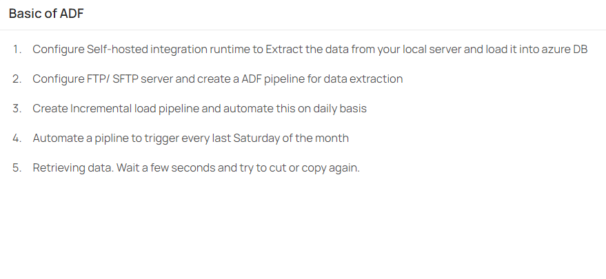
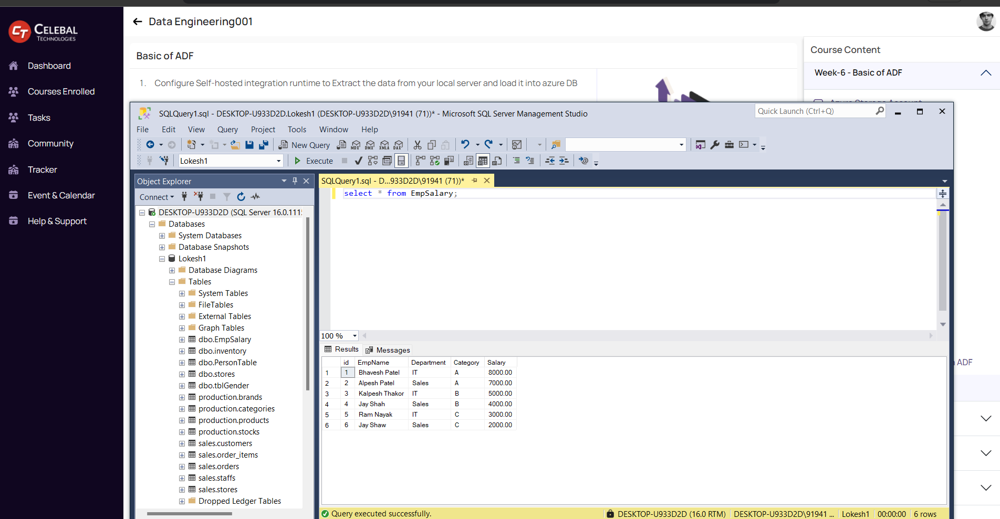

# Data-Engineering-Week6-Assignment

# ADF Data Pipelines

## Overview
This repository contains Azure Data Factory (ADF) pipeline configurations for various data engineering tasks.

## Files
- `pipeline.json`: ADF pipeline for copying data from a local SQL Server to Azure SQL Database.
- `linkedServiceFTP.json`: Linked service configuration for connecting to an FTP server.
- `incrementalLoadPipeline.json`: ADF pipeline for incremental loading of data.
- `monthlyTriggerPipeline.json`: Custom trigger configuration to run a pipeline on the last Saturday of every month.

## Tasks
1. **Configure Self-Hosted Integration Runtime to Move Data from Local SQL Server to Azure SQL Database:**
    ### Steps
    1. **Set Up Local SQL Server**
       - Installed SQL Server and SSMS.
       - Created a database - "Lokesh1" and table - "EmpSalary", and    inserted sample data.

       

    2. **Set Up Azure SQL Database**
       - Created an Azure SQL Database.
       - Configured firewall settings to allow access.

    3. **Configure Self-Hosted Integration Runtime**
       - Installed and configured the integration runtime.
       - Registered it with ADF.

    4. **Create Linked Services in ADF**
       - Created linked services for local SQL Server and Azure SQL Database.

    5. **Create and Run Pipeline**
       - Created a pipeline with a "Copy Data" activity.
       - Configured source and destination datasets.
       - Ran the pipeline to move data.

2. **FTP/SFTP Data Extraction Pipeline:**
   - Extracts data from an FTP/SFTP server and loads it into Azure SQL Database.

3. **Incremental Load Pipeline:**
   - Performs incremental data load based on the `LastModified` timestamp.
   - Automated to run on a daily basis.

4. **Monthly Trigger Pipeline:**
   - Runs a pipeline on the last Saturday of every month.

## Usage
1. **Configure Linked Services:**
   - Update the `linkedServiceFTP.json` with your FTP server details.
   - Create similar linked service configurations for other data sources and destinations as needed.

2. **Deploy Pipelines:**
   - Import the JSON files into your Azure Data Factory.

3. **Run and Monitor:**
   - Run the pipelines and monitor their execution in ADF.

